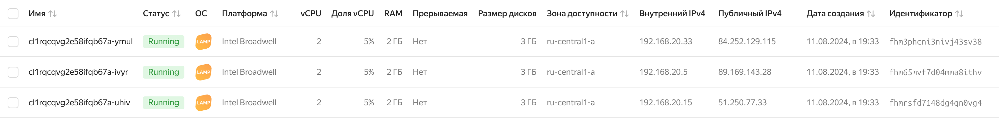

# Домашнее задание к занятию «Вычислительные мощности. Балансировщики нагрузки»

##### 1. Создать бакет Object Storage и разместить в нём файл с картинкой
```tf
resource "yandex_storage_bucket" "my_bucket" {
  bucket     = "${var.student_name}-${formatdate("YYYYMMDD", timestamp())}"
  acl        = var.storage_acl
  access_key = (var.YC_ACCESS_KEY)
  secret_key = (var.YC_SECRET_KEY)
}

resource "null_resource" "upload_image" {
  depends_on = [yandex_storage_bucket.my_bucket]

  provisioner "local-exec" {
    command = <<EOT
      export AWS_ACCESS_KEY_ID=$${YC_ACCESS_KEY} 
      export AWS_SECRET_ACCESS_KEY=$${YC_SECRET_KEY}
      aws --endpoint-url=https://storage.yandexcloud.net s3 cp ~/study/image.jpg s3://${yandex_storage_bucket.my_bucket.bucket}/image.jpg
    EOT
  }
}

resource "null_resource" "empty_bucket" {
  provisioner "local-exec" {
    command = <<EOT
      export AWS_ACCESS_KEY_ID=$${YC_ACCESS_KEY} 
      export AWS_SECRET_ACCESS_KEY=$${YC_SECRET_KEY}
      aws --endpoint-url=https://storage.yandexcloud.net s3 rm s3://${yandex_storage_bucket.my_bucket.bucket} --recursive
      sleep 20
    EOT
  }

  triggers = {
    bucket_id = yandex_storage_bucket.my_bucket.id
  }
}
```

##### 2. Создать группу ВМ в public подсети фиксированного размера с шаблоном LAMP и веб-страницей, содержащей ссылку на картинку из бакета
```tf
resource "yandex_compute_instance_group" "lamp_group" {
  name               = var.instance_group_name
  service_account_id = var.service_account_id

  instance_template {
    platform_id = var.platform_id
    resources {
      cores         = var.public_vm_resources.cores
      memory        = var.public_vm_resources.memory
      core_fraction = var.public_vm_resources.core_fraction
    }
    boot_disk {
      initialize_params {
        image_id = var.image_id
      }
    }
    network_interface {
      subnet_ids = [yandex_vpc_subnet.public_subnet.id]
      nat        = true
    }

    metadata = {
      user-data = <<-EOF
        #cloud-config
        users:
          - name: ${var.vm_metadata.username}
            ssh-authorized-keys:
              - ${file(var.vm_metadata.ssh_key)}
            sudo: ${var.vm_metadata.sudo_privileges}
            shell: ${var.vm_metadata.shell}

        #!/bin/bash
        apt update && apt install -y apache2 mysql-server php libapache2-mod-php php-mysql
        echo "<html><body><h1>Welcome to LAMP</h1></body></html>" > /var/www/html/index.html
        systemctl restart apache2
      EOF
    }
  }

  scale_policy {
    fixed_scale {
      size = 3
    }
  }

  allocation_policy {
    zones = [var.zone]
  }

  deploy_policy {
    max_unavailable = 1
    max_expansion   = 0
  }

  health_check {
    interval            = 10
    timeout             = 5
    healthy_threshold   = 2
    unhealthy_threshold = 4
    tcp_options {
      port = 80
    }
  }
}
```


##### 3. Подключить группу к сетевому балансировщику
###### (дополнительно)* Создать Application Load Balancer с использованием Instance group и проверкой состояния
```tf
resource "yandex_lb_network_load_balancer" "lb" {
  name      = var.lb_name
  region_id = var.region_id

  listener {
    name     = "http"
    port     = 80
    protocol = "tcp"
    target_port = 80
  }

  attached_target_group {
    target_group_id = yandex_lb_target_group.target_group.id

    healthcheck {
      name = "http"
      http_options {
        port = 80
        path = "/"
      }
      interval            = 5
      timeout             = 4
      healthy_threshold   = 2
      unhealthy_threshold = 4
    }
  }
}
```

#### Скриншоты


### Ссылки на манифесы
- [instance_group.tf](./instance_group.tf)
- [load-balancer.tf](./load-balancer.tf)
- [network.tf](./network.tf)
- [providers.tf](./providers.tf)
- [storage.tf](./storage.tf)
- [target_group.tf](./target_group.tf)
- [variables.tf](./variables.tf)
- [outputs.tf](./outputs.tf)