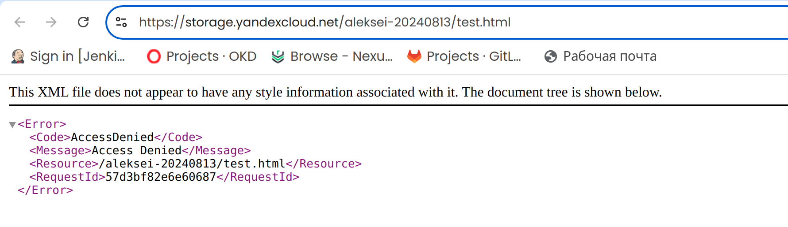
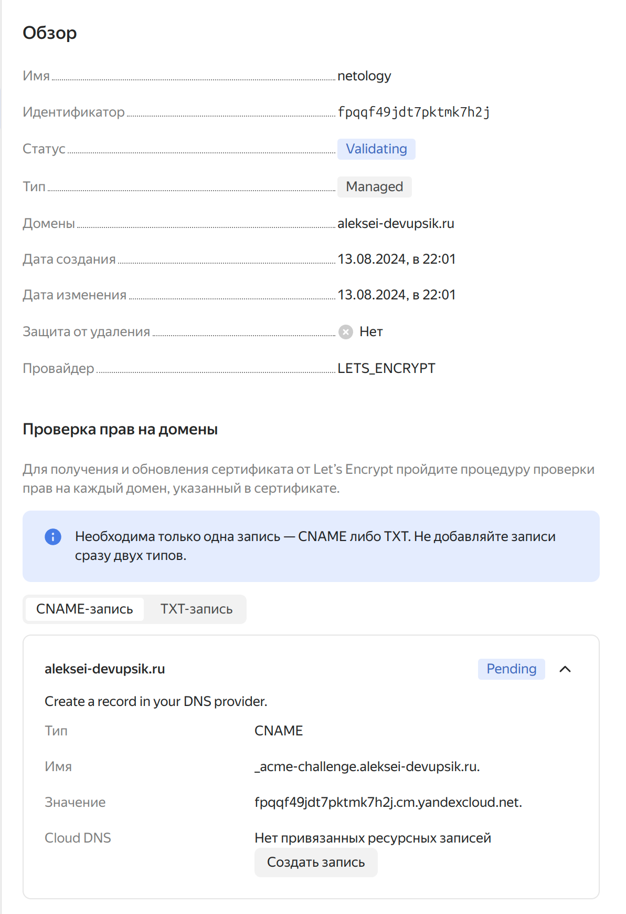
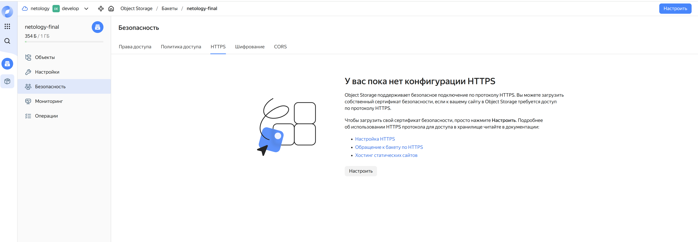
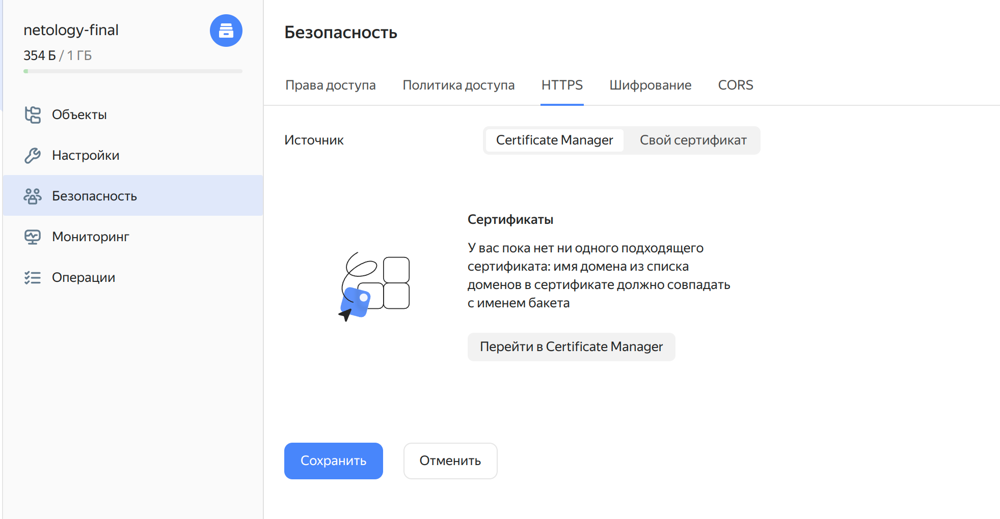

# Домашнее задание к занятию «Безопасность в облачных провайдерах»

### 1. С помощью ключа в KMS необходимо зашифровать содержимое бакета

###### Обновлено содержимое [storage.tf](./storage.tf), добавлен ресурс yandex_kms_symmetric_key

```tf
// Создание симметричного ключа в KMS с помощью ресурса yandex_kms_symmetric_key

resource "yandex_kms_symmetric_key" "bucket_key" {
  name                = var.kms_key_name
  description         = "Key for encrypting bucket contents"
  default_algorithm   = "AES_256"
  rotation_period     = var.kms_key_rotation_period
  deletion_protection = false
}

resource "yandex_storage_bucket" "my_bucket" {
  bucket     = "${var.student_name}-${formatdate("YYYYMMDD", timestamp())}"
  acl        = var.storage_acl
  access_key = var.YC_ACCESS_KEY
  secret_key = var.YC_SECRET_KEY
}

resource "null_resource" "upload_image" {
  depends_on = [yandex_storage_bucket.my_bucket]

  provisioner "local-exec" {
    command = <<EOT
      export AWS_ACCESS_KEY_ID=${var.YC_ACCESS_KEY} 
      export AWS_SECRET_ACCESS_KEY=${var.YC_SECRET_KEY}

      // Шифрование объектов на этапе их загрузки с использованием KMS.
      
      aws --endpoint-url=https://storage.yandexcloud.net s3 cp ~/study/test.html s3://${yandex_storage_bucket.my_bucket.bucket}/test.html --sse aws:kms --sse-kms-key-id ${yandex_kms_symmetric_key.bucket_key.id}
    EOT
  }
}

resource "null_resource" "empty_bucket" {
  provisioner "local-exec" {
    command = <<EOT
      export AWS_ACCESS_KEY_ID=$${YC_ACCESS_KEY} 
      export AWS_SECRET_ACCESS_KEY=$${YC_SECRET_KEY}
      aws --endpoint-url=https://storage.yandexcloud.net s3 rm s3://${yandex_storage_bucket.my_bucket.bucket} --recursive
      sleep 20
    EOT
  }

  triggers = {
    bucket_id = yandex_storage_bucket.my_bucket.id
  }
}

```

##### Добавлены переменные в [variables.tf](./variables.tf)
```tf
############################################
# Настройки KMS
############################################

variable "kms_key_name" {
  description = "Название ключа KMS для шифрования содержимого бакета"
  type        = string
  default     = "bucket-encryption-key"
}

variable "kms_key_rotation_period" {
  description = "Период ротации ключа KMS"
  type        = string
  default     = "24h"
}
```

#### Результат:


---

### 2. Создать статический сайт в Object Storage c собственным публичным адресом и сделать доступным по HTTPS

#### Серт уже несколько дней валидируется, ждать нет смысла, прошу зачесть задание. (Ниже описание потенциального решения задания)



#### Настройка HTTPS и сертификата
##### 1. Создание сертификата в Yandex Cloud Certificate Manager:
- В Yandex Cloud Console перейдите в раздел "Certificate Manager".
- Создайте новый сертификат, указав домен вашего сайта.
##### 2. Настройка HTTPS для статического сайта:
- В разделе "Object Storage" выберите бакет.
- В настройках статического хостинга включите опцию "HTTPS" и выберите созданный сертификат.


