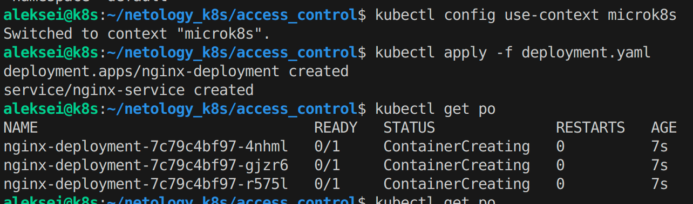
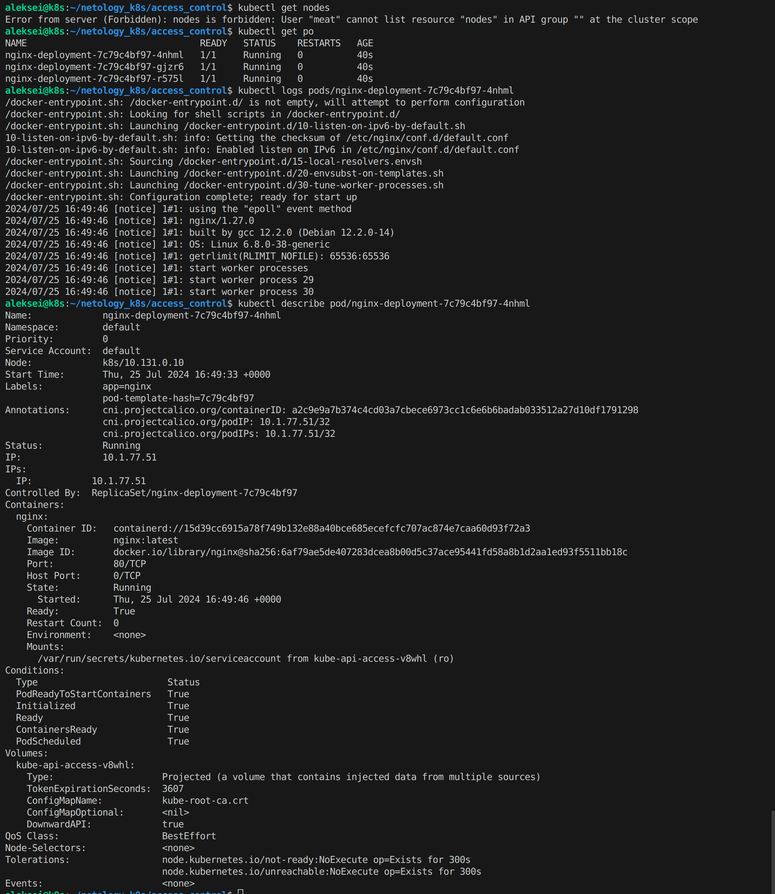

# Домашнее задание к занятию «Управление доступом»

---

## Задание 1. Создайте конфигурацию для подключения пользователя

### Создаем ключ и сертификат для пользователя meat:
```
openssl genrsa -out meat.key 2048
openssl req -new -key meat.key -out meat.csr -subj "/CN=meat/O=devops"
```
### Подписываем сертификат с помощью CA-кластера:
```
sudo openssl x509 -req -in meat.csr -CA /var/snap/microk8s/current/certs/ca.crt -CAkey /var/snap/microk8s/current/certs/ca.key -CAcreateserial -out meat.crt -days 365
```
### Создаем файл конфигурации kubectl:
```
kubectl config set-credentials meat --client-certificate=meat.crt --client-key=meat.key
kubectl config set-context microk8s-context --cluster=microk8s-cluster --user=meat
kubectl config use-context microk8s-context
```
### Применяем манифесты 
```
kubectl apply -f role.yaml
kubectl apply -f rolebinding.yaml
```


### Результаты


---

## Ссылки
Посмотреть содержимое:
- [role.yaml](./role.yaml)
- [rolebinding.yaml](./rolebinding.yaml)