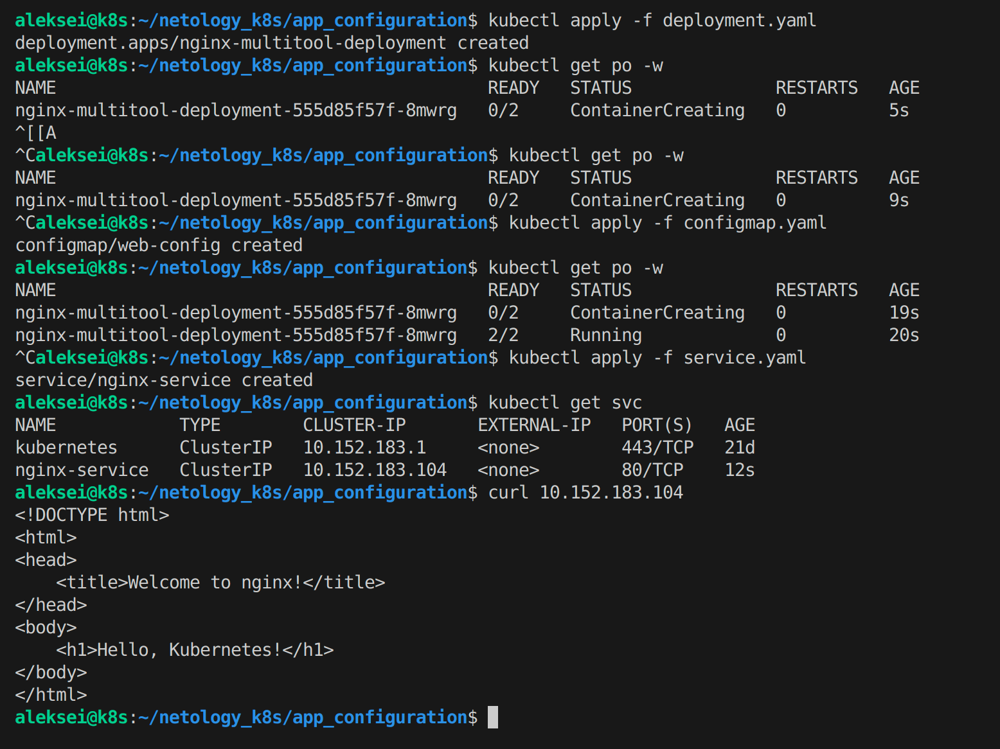
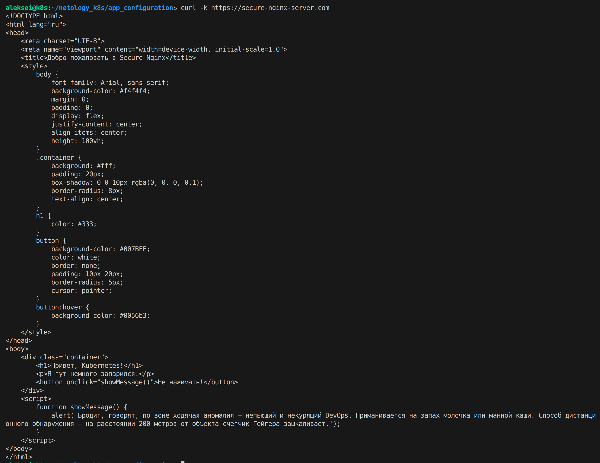

# Домашнее задание к занятию «Конфигурация приложений»

---

## Задание 1. Создать Deployment приложения и решить возникшую проблему с помощью ConfigMap. Добавить веб-страницу



---

## Задание 2. Создать приложение с вашей веб-страницей, доступной по HTTPS

### Генерация сертификатов и создание секрета
```
openssl req -x509 -nodes -days 365 -newkey rsa:2048 -keyout tls.key -out tls.crt -subj "/CN=secure-nginx-server.com"
kubectl create secret tls ssl-cert --key tls.key --cert tls.crt
```
### Запрос https


---

## Ссылки
Посмотреть содержимое:
- [Task_1 - deployment.yaml](./task_1/deployment.yaml)
- [Task_1 - configmap.yaml](./task_1/configmap.yaml)
- [Task_1 - service.yaml](./task_1/service.yaml)  
- [Task_2 - deployment.yaml](./task_2/deployment-secure.yaml)
- [Task_2 - configmap.yaml](./task_2/configmap-secure.yaml)
- [Task_2 - ingress.yaml](./task_2/ingress-secure.yaml)
- [Task_2 - service.yaml](./task_2/service-secure.yaml)