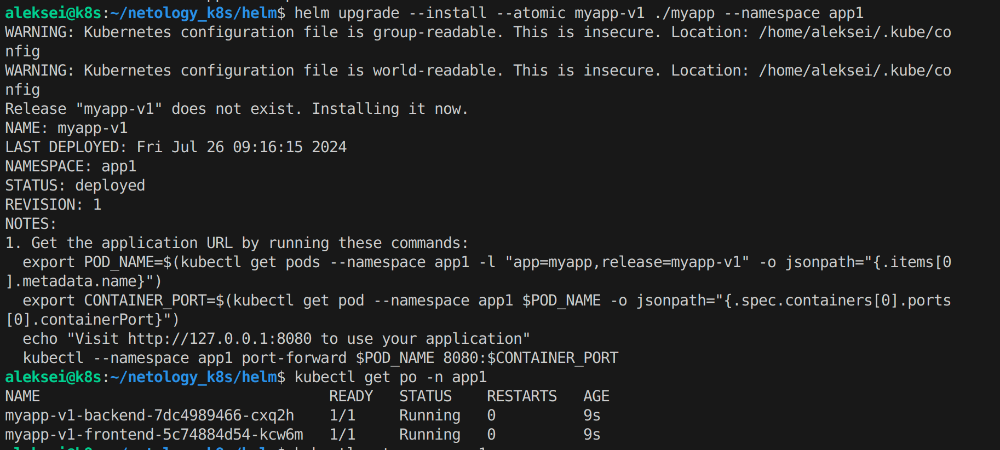

# Домашнее задание к занятию «Helm»

---

## Задание 1. Подготовить Helm-чарт для приложения
```
helm upgrade --install --atomic myapp-v1 ./myapp --namespace app1
```


---
 
## Задание 2. Запустить две версии в разных неймспейсах
### myapp_v1 (namespace=app1)
```
helm upgrade --install --atomic myapp-v1 ./myapp --namespace app1
```

### myapp_v2 (namespace=app1)
```
helm upgrade --install --atomic myapp-v2 ./myapp --namespace app1 --set frontend.image.tag=1.24.0 --set backend.image.tag=c3d4e04
```

### myapp_v3 (namespace=app2)
```
helm upgrade --install --atomic myapp-v3 ./myapp --namespace app2 --set frontend.image.tag=1.20.2 --set backend.image.tag=54606ec
```


---

## Ссылки
Посмотреть содержимое:
- [backend-deployment.yaml](./myapp/templates/backend-deployment.yaml)
- [backend-service.yaml](./myapp/templates/backend-service.yaml)
- [frontend-deployment.yaml](./myapp/templates/frontend-deployment.yaml)
- [frontend-service.yaml](./myapp/templates/frondend-service.yaml)
- [hpa.yaml](./myapp/templates/hpa.yaml)
- [ingress.yaml](./myapp/templates/ingress.yaml)
- [serviceaccount.yaml](./myapp/templates/serviceaccount.yaml)
- [value.yaml](./myapp/values.yaml)
- [Chart.yaml](./myapp/Chart.yaml)
- [test-connection.yaml](./myapp/templates/tests/test-connection.yaml)