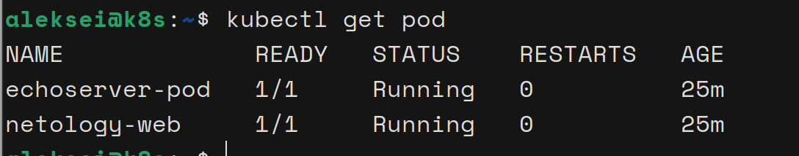
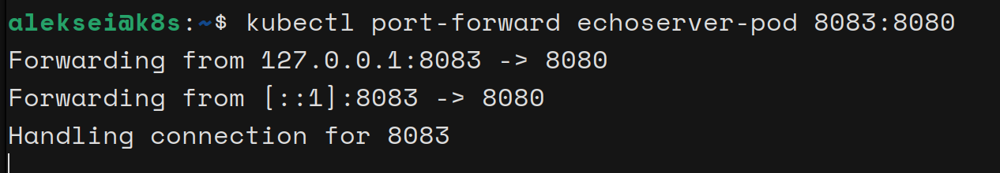
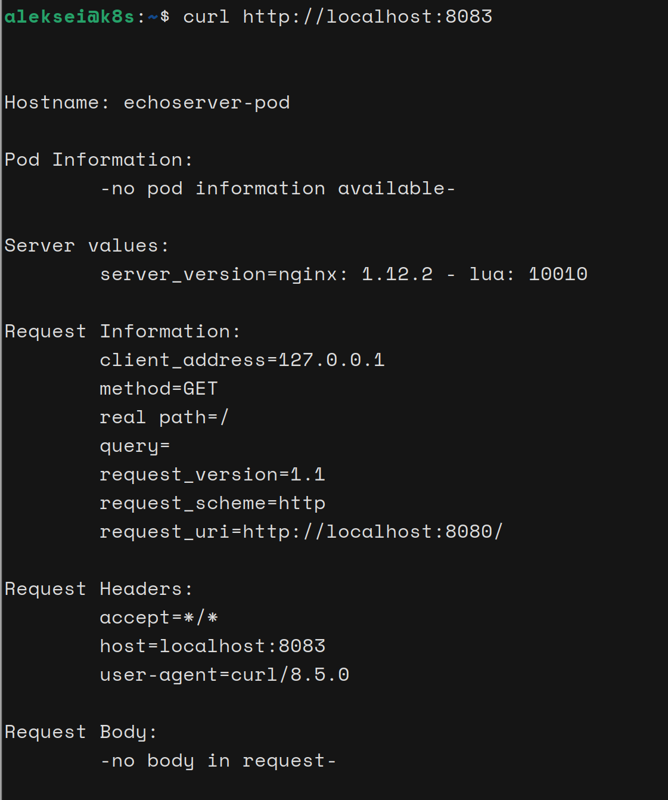
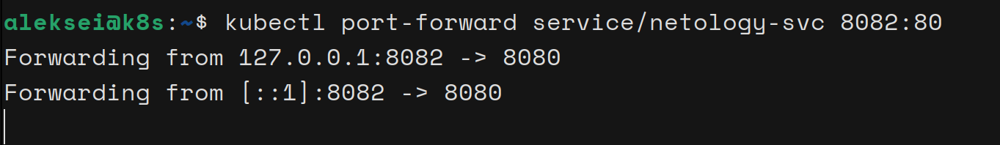
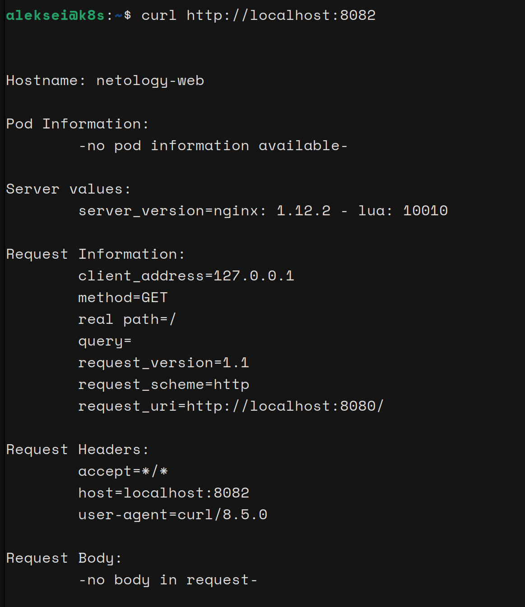

# Домашнее задание к занятию «Базовые объекты K8S»

---

## kubectl_get_pod

---

## Задание 1. Создать Pod с именем hello-world
#### *P.S Увидел что под нужно назвать hello-world только после того как начал оформлять README.md, лень менять* :-P

---

## Задание 2. Создать Service и подключить его к Pod

---

## Ссылки
Посмотреть содержимое:
- [echoserver-pod.yaml](./echoserver-pod.yaml)
- [netology-web.yaml](./netology-web.yaml)
- [netology-svc.yaml](./netology-svc.yaml)