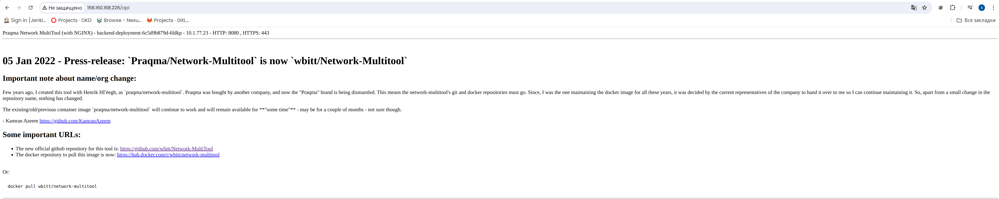

# Домашнее задание к занятию «Сетевое взаимодействие в K8S. Часть 2»

---

## Задание 1. Создать Deployment приложений backend и frontend

---

## Задание 2. Создать Ingress и обеспечить доступ к приложениям снаружи кластера

---

## Ссылки
Посмотреть содержимое:
- [backend-deployment.yaml](./backend-deployment.yaml)
- [frontend-deployment.yaml](./frontend-deployment.yaml)
- [backend-service.yaml](./backend-service.yaml)
- [frontend-service.yaml](./frontend-service.yaml)
- [multitool-pod.yaml](./multitool-pod.yaml)
- [ingress.yaml](./ingress.yaml)