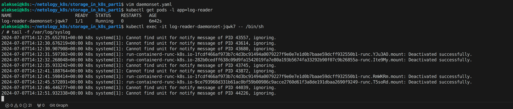

# Домашнее задание к занятию «Хранение в K8s. Часть 1»

---

## Задание 1. Создать Deployment приложения, состоящего из двух контейнеров и обменивающихся данными.

---

## Задание 2. Создать DaemonSet приложения, которое может прочитать логи ноды.

---

## Ссылки
Посмотреть содержимое:
- [deployment.yaml](./deployment.yaml)
- [daemonset.yaml](./daemonset.yaml)