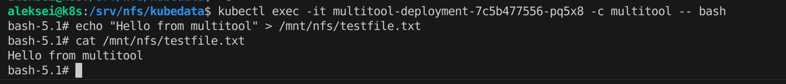

# Домашнее задание к занятию «Хранение в K8s. Часть 1»

---

## Задание 1. Создать Deployment приложения, использующего локальный PV, созданный вручную.

##### Продемонстрировать, что multitool может читать файл, в который busybox пишет каждые пять секунд в общей директории.


##### Удалить Deployment и PVC. Продемонстрировать, что после этого произошло с PV. Пояснить, почему
```bash
kubectl delete -f deployment.yaml
kubectl delete -f pvc.yaml
```


**Пояснение:**
После удаления Deployment и PVC, PV останется в состоянии Released, потому что данные на локальном диске не удаляются автоматически

##### Продемонстрировать, что файл сохранился на локальном диске ноды


##### Удалить PV. Продемонстрировать что произошло с файлом после удаления PV. Пояснить, почему.
```bash
kubectl delete -f pv.yaml
```


**Пояснение:**
Файл должен оставаться на локальном диске после удаления PV, так как удаление PV не влияет на данные, хранящиеся на локальном диске

## Манифесты
Посмотреть содержимое:
- [deployment.yaml](./task_1/deployment.yaml)
- [pvc.yaml](./task_1/pvc.yaml)
- [pv.yaml](./task_1/pv.yaml)

---

## Задание 2. Создать Deployment приложения, которое может хранить файлы на NFS с динамическим созданием PV.
##### Включить и настроить NFS-сервер на MicroK8S.
```bash
# Установка NFS-сервера:
sudo apt-get install nfs-kernel-server

# Создание директории для экспорта:
sudo mkdir -p /srv/nfs/kubedata

# Изменение владельца директории:
sudo chown nobody:nogroup /srv/nfs/kubedata

# Настройка экспорта директории:
echo "/srv/nfs/kubedata *(rw,sync,no_subtree_check,no_root_squash)" | sudo tee -a /etc/exports

# Обновление экспорта:
sudo exportfs -rav

# Перезапуск NFS-сервера:
sudo systemctl restart nfs-kernel-server
```


##### Продемонстрировать возможность чтения и записи файла изнутри пода

---

## Манифесты
Посмотреть содержимое:
- [deployment.yaml](./task_2/deployment.yaml)
- [pvc.yaml](./task_2/pvc.yaml)
- [pv.yaml](./task_2/pv.yaml)
