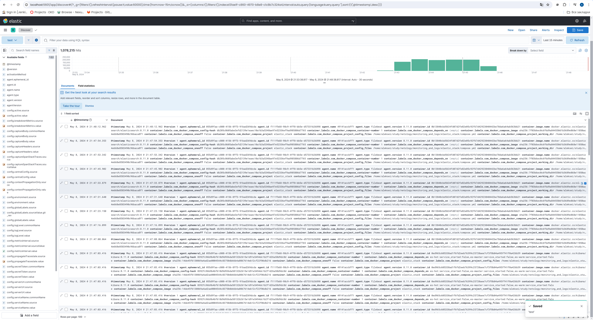

# Домашнее задание к занятию "Средство визуализации Grafana"
---
## Задание повышенной сложности
---
### Containers


### Kibana


### Docker-compose манифест

Этот файл содержит конфигурацию для запуска стека Elastic с помощью Docker Compose. В файле определены службы для различных компонентов Elastic Stack, включая Elasticsearch, Kibana, Metricbeat, Filebeat и Logstash. Каждая служба настроена с необходимыми зависимостями, объемами, сетевыми настройками и параметрами окружения.

```yml
volumes:
  esdata-master:
    driver: local
  esdata-hot:
    driver: local
  esdata-warm:
    driver: local
  kibanadata:
    driver: local
  metricbeatdata:
    driver: local
  filebeatdata:
    driver: local
  logstashdata:
    driver: local

networks:
  elastic:
    driver: bridge

services:
  # Мастер-узел Elasticsearch, управляющий кластером, не обрабатывающий данные.
  es-master:
    image: docker.elastic.co/elasticsearch/elasticsearch:${STACK_VERSION}
    volumes:
      - esdata-master:/usr/share/elasticsearch/data
    environment:
      - node.name=es-master
      - node.roles=master
      - cluster.name=${CLUSTER_NAME}
      - cluster.initial_master_nodes=es-master
      - discovery.seed_hosts=es-hot,es-warm,es-master
      - ELASTIC_PASSWORD=${ELASTIC_PASSWORD}
      - bootstrap.memory_lock=true
      - xpack.security.enabled=false
    mem_limit: ${ES_MEM_LIMIT}
    ulimits:
      memlock:
        soft: -1
        hard: -1

  # Горячий узел Elasticsearch, предназначен для индексации и обработки активных данных.
  es-hot:
    image: docker.elastic.co/elasticsearch/elasticsearch:${STACK_VERSION}
    volumes:
      - esdata-hot:/usr/share/elasticsearch/data
    ports:
      - ${ES_PORT}:9200
    environment:
      - node.name=es-hot
      - node.roles=data_hot,data_content
      - cluster.name=${CLUSTER_NAME}
      - discovery.seed_hosts=es-hot,es-warm,es-master
      - ELASTIC_PASSWORD=${ELASTIC_PASSWORD}
      - bootstrap.memory_lock=true
      - xpack.security.enabled=false
    mem_limit: ${ES_MEM_LIMIT}
    ulimits:
      memlock:
        soft: -1
        hard: -1

  # Теплый узел Elasticsearch, используемый для хранения менее активных данных.
  es-warm:
    image: docker.elastic.co/elasticsearch/elasticsearch:${STACK_VERSION}
    volumes:
      - esdata-warm:/usr/share/elasticsearch/data
    environment:
      - node.name=es-warm
      - node.roles=data_warm
      - cluster.name=${CLUSTER_NAME}
      - discovery.seed_hosts=es-hot,es-warm,es-master
      - ELASTIC_PASSWORD=${ELASTIC_PASSWORD}
      - bootstrap.memory_lock=true
      - xpack.security.enabled=false
    mem_limit: ${ES_MEM_LIMIT}
    ulimits:
      memlock:
        soft: -1
        hard: -1

  kibana:
    depends_on:
      - es-hot
      - es-master
      - es-warm
    image: docker.elastic.co/kibana/kibana:${STACK_VERSION}
    volumes:
      - kibanadata:/usr/share/kibana/data
    ports:
      - ${KIBANA_PORT}:5601
    environment:
      - SERVER_NAME=kibana
      - ELASTICSEARCH_HOSTS=http://es-hot:9200
      - ELASTICSEARCH_USERNAME=kibana_system
      - ELASTICSEARCH_PASSWORD=${KIBANA_PASSWORD}
    mem_limit: ${KB_MEM_LIMIT}

  metricbeat:
    depends_on:
      - es-hot
      - es-master
      - es-warm
      - kibana
    image: docker.elastic.co/beats/metricbeat:${STACK_VERSION}
    user: root
    volumes:
      - metricbeatdata:/usr/share/metricbeat/data
      - "./metricbeat.yml:/usr/share/metricbeat/metricbeat.yml:ro"
      - "/var/run/docker.sock:/var/run/docker.sock:ro"
      - "/sys/fs/cgroup:/hostfs/sys/fs/cgroup:ro"
      - "/proc:/hostfs/proc:ro"
      - "/:/hostfs:ro"
    environment:
      - ELASTIC_USER=elastic
      - ELASTIC_PASSWORD=${ELASTIC_PASSWORD}
      - ELASTIC_HOSTS=http://es-hot:9200
      - KIBANA_HOSTS=http://kibana:5601
      - LOGSTASH_HOSTS=http://logstash:9600
    command:
      - --strict.perms=false

  filebeat:
    depends_on:
      - es-hot
      - es-master
      - es-warm
    image: docker.elastic.co/beats/filebeat:${STACK_VERSION}
    user: root
    volumes:
      - filebeatdata:/usr/share/filebeat/data
      - "./filebeat.yml:/usr/share/filebeat/filebeat.yml:ro"
      - "/var/lib/docker/containers:/var/lib/docker/containers:ro"
      - "/var/run/docker.sock:/var/run/docker.sock:ro"
    environment:
      - ELASTIC_USER=elastic
      - ELASTIC_PASSWORD=${ELASTIC_PASSWORD}
      - ELASTIC_HOSTS=http://es-hot:9200
      - KIBANA_HOSTS=http://kibana:5601
      - LOGSTASH_HOSTS=http://logstash:9600
    command:
      - --strict.perms=false

  logstash:
    depends_on:
      - es-hot
      - es-master
    image: docker.elastic.co/logstash/logstash:${STACK_VERSION}
    volumes:
      - logstashdata:/usr/share/logstash/data
      - "./logstash.conf:/usr/share/logstash/pipeline/logstash.conf:ro"
    environment:
      - xpack.monitoring.enabled=false
      - ELASTIC_USER=elastic
      - ELASTIC_PASSWORD=${ELASTIC_PASSWORD}
      - ELASTIC_HOSTS=http://es-hot:9200
```
### Конфигурации для стека

#### metricbeat.yml

Файл конфигурации для Metricbeat, который используется для сбора метрик с Elastic Stack и хост-системы. Он определяет модули для мониторинга Elasticsearch, Logstash, Kibana, а также метрики Docker-контейнеров. Файл также включает настройки для отправки собранных метрик непосредственно в Elasticsearch.

```yml
metricbeat.config.modules:
#  path: ${path.config}/modules.d/*.yml на случай использования дополнительных модулей
  reload.enabled: false

metricbeat.modules:
- module: elasticsearch
  xpack.enabled: true
  period: 10s
  hosts: ${ELASTIC_HOSTS}
  username: ${ELASTIC_USER}
  password: ${ELASTIC_PASSWORD}

- module: logstash
  xpack.enabled: true
  period: 10s
  hosts: ${LOGSTASH_HOSTS}

- module: kibana
  metricsets: 
    - stats
  period: 10s
  hosts: ${KIBANA_HOSTS}
  username: ${ELASTIC_USER}
  password: ${ELASTIC_PASSWORD}
  xpack.enabled: true

- module: docker
  metricsets:
    - "container"
    - "cpu"
    - "diskio"
    - "healthcheck"
    - "info"
    - "memory"
    - "network"
  hosts: ["unix:///var/run/docker.sock"]
  period: 10s
  enabled: true

processors:
  - add_host_metadata: ~
  - add_docker_metadata: ~

output.elasticsearch:
  hosts: ${ELASTIC_HOSTS}
  username: ${ELASTIC_USER}
  password: ${ELASTIC_PASSWORD}
```

#### logstash.conf

Конфигурационный файл для Logstash, определяющий как данные будут обрабатываться перед индексацией в Elasticsearch. Включает определения для входных данных (input), фильтрации (filter) и вывода (output). Logstash в этой конфигурации настроен на чтение данных из CSV-файлов, применение фильтра JSON и отправку обработанных данных в Elasticsearch.

```conf
input {
  beats {
    port => 5044
  }
}

filter {
    json {
      source => "message"
    }
}

output {
  elasticsearch {
    index => "logstash-%{+YYYY.MM.dd}"
    hosts => "${ELASTIC_HOSTS}"
    user => "${ELASTIC_USER}"
    password => "${ELASTIC_PASSWORD}"
  }
}
```

#### filebeat.yml

Файл конфигурации для Filebeat, который используется для сбора и отправки логов в Logstash или Elasticsearch. Определяет настройки для обнаружения лог-файлов в контейнерах Docker, применения метаданных Docker к логам и настройки для отправки данных в Elasticsearch.

```yml
filebeat.inputs:
- type: container
  paths:
    - '/var/lib/docker/containers/*/*.log'

filebeat.autodiscover:
  providers:
    - type: docker
      hints.enabled: true

  decode_json_fields:
      fields: ["message"]
      target: "json"
      overwrite_keys: true

processors:
  - add_docker_metadata:
      host: "unix:///var/run/docker.sock"
      match_short_id: true

setup.kibana:
  host: "${KIBANA_HOSTS}"
  username: "${ELASTIC_USER}"
  password: "${ELASTIC_PASSWORD}"

output.logstash:
  hosts: ["logstash:5044"]
```

#### .env

Файл окружения, содержащий переменные окружения, используемые в compose.yml. Включает пароли для пользователей Elastic и Kibana, версию Elastic Stack, а также параметры конфигурации, такие как имена кластеров, порты и лимиты памяти.


```txt
# Пароль для пользователя 'elastic' (не менее 6 символов)
ELASTIC_PASSWORD=qwerty12345

# Пароль для пользователя 'kibana_system' (не менее 6 символов)
KIBANA_PASSWORD=qwerty12345

# Версия продуктов Elastic
STACK_VERSION=8.11.0

# Установите имя кластера
CLUSTER_NAME=docker-cluster

# Порт для доступа к HTTP API Elasticsearch с хоста
ES_PORT=9200

# Порт для доступа к Kibana с хоста
KIBANA_PORT=5601

# Увеличьте или уменьшите в зависимости от доступной памяти хоста (в байтах)
ES_MEM_LIMIT=1073741824
KB_MEM_LIMIT=1073741824
LS_MEM_LIMIT=1073741824
```