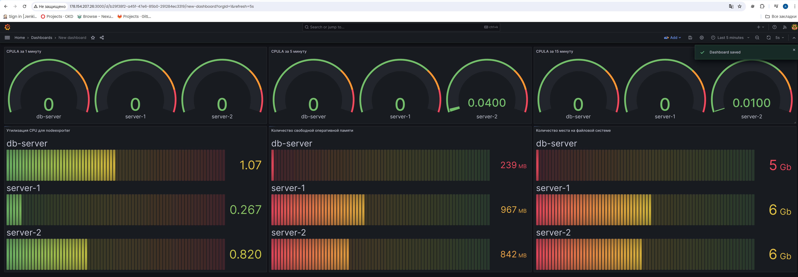
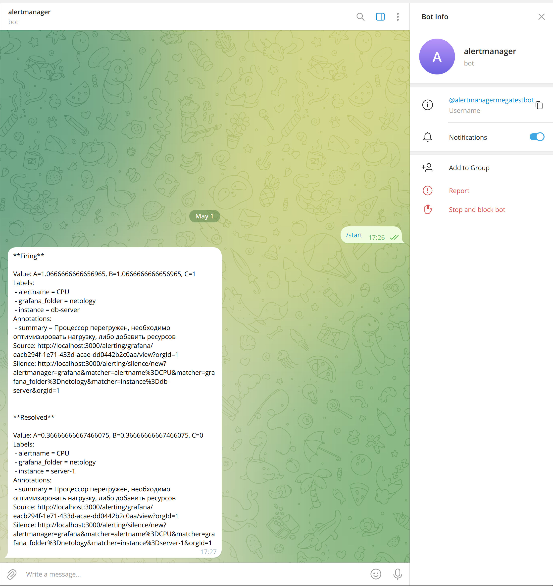

# Домашнее задание к занятию "Средство визуализации Grafana"
---
## Задание повышенной сложности
---
Для создания ВМ был создан terraform файл.
Для разворачивания и настройки Grafana был создан ansible playbook с 3-мя ролями:
- grafana
- node-exporter
- prometheus

Подробное содержание можно изучить в репозитории.

#### Конфигурационные файлы

**node_exporter.service.j2**
```j2
[Unit]
Description=Node Exporter Version {{ node_exporter_version }}
After=network-online.target
[Service]
User={{ node_exporter_user }}
Group={{ node_exporter_user }}
Type=simple
ExecStart={{ node_exporter_bin }}
[Install]
WantedBy=multi-user.target
```

**prometheus.j2**
```j2
ARGS="--web.enable-lifecycle --storage.tsdb.retention.time={{ prometheus_retention_time }} --web.console.templates=/etc/prometheus/consoles --web.console.libraries=/etc/prometheus/console_libraries
```

**prometheus.yml.j2**
```j2
#jinja2: lstrip_blocks: "True"
{{ prometheus_var_config | to_nice_yaml(indent=2) }}

- job_name: node
  scrape_interval: 15s
  metrics_path: /metrics
  static_configs:
  - targets:

    - '{{ hostvars[server]["ansible_host"] }}:9100'
    lables:
      instance: '{{ server }}'


```

### Dashboard


### AlertManager


### JSON-model
```json
{
  "annotations": {
    "list": [
      {
        "builtIn": 1,
        "datasource": {
          "type": "grafana",
          "uid": "-- Grafana --"
        },
        "enable": true,
        "hide": true,
        "iconColor": "rgba(0, 211, 255, 1)",
        "name": "Annotations & Alerts",
        "type": "dashboard"
      }
    ]
  },
  "editable": true,
  "fiscalYearStartMonth": 0,
  "graphTooltip": 0,
  "id": 2,
  "links": [],
  "liveNow": false,
  "panels": [
    {
      "datasource": {
        "type": "prometheus",
        "uid": "a7f756d3-2d8f-4685-b98d-09f93f61e62c"
      },
      "fieldConfig": {
        "defaults": {
          "mappings": [],
          "max": 2,
          "min": 0,
          "thresholds": {
            "mode": "percentage",
            "steps": [
              {
                "color": "green",
                "value": null
              },
              {
                "color": "orange",
                "value": 70
              },
              {
                "color": "red",
                "value": 85
              }
            ]
          }
        },
        "overrides": []
      },
      "gridPos": {
        "h": 8,
        "w": 8,
        "x": 0,
        "y": 0
      },
      "id": 2,
      "options": {
        "minVizHeight": 75,
        "minVizWidth": 75,
        "orientation": "auto",
        "reduceOptions": {
          "calcs": [
            "lastNotNull"
          ],
          "fields": "",
          "values": false
        },
        "showThresholdLabels": false,
        "showThresholdMarkers": true
      },
      "pluginVersion": "10.2.0",
      "targets": [
        {
          "datasource": {
            "type": "prometheus",
            "uid": "a7f756d3-2d8f-4685-b98d-09f93f61e62c"
          },
          "editorMode": "code",
          "expr": "node_load1",
          "instant": false,
          "legendFormat": "{{instance}}",
          "range": true,
          "refId": "A"
        }
      ],
      "title": "CPULA за 1 минуту",
      "type": "gauge"
    },
    {
      "datasource": {
        "type": "prometheus",
        "uid": "a7f756d3-2d8f-4685-b98d-09f93f61e62c"
      },
      "fieldConfig": {
        "defaults": {
          "mappings": [],
          "max": 2,
          "thresholds": {
            "mode": "percentage",
            "steps": [
              {
                "color": "green",
                "value": null
              },
              {
                "color": "orange",
                "value": 70
              },
              {
                "color": "red",
                "value": 85
              }
            ]
          }
        },
        "overrides": []
      },
      "gridPos": {
        "h": 8,
        "w": 8,
        "x": 8,
        "y": 0
      },
      "id": 3,
      "options": {
        "minVizHeight": 75,
        "minVizWidth": 75,
        "orientation": "auto",
        "reduceOptions": {
          "calcs": [
            "lastNotNull"
          ],
          "fields": "",
          "values": false
        },
        "showThresholdLabels": false,
        "showThresholdMarkers": true
      },
      "pluginVersion": "10.2.0",
      "targets": [
        {
          "datasource": {
            "type": "prometheus",
            "uid": "a7f756d3-2d8f-4685-b98d-09f93f61e62c"
          },
          "editorMode": "code",
          "expr": "node_load5",
          "instant": false,
          "legendFormat": "{{instance}}",
          "range": true,
          "refId": "A"
        }
      ],
      "title": "CPULA за 5 минуту",
      "type": "gauge"
    },
    {
      "datasource": {
        "type": "prometheus",
        "uid": "a7f756d3-2d8f-4685-b98d-09f93f61e62c"
      },
      "fieldConfig": {
        "defaults": {
          "mappings": [],
          "max": 2,
          "thresholds": {
            "mode": "percentage",
            "steps": [
              {
                "color": "green",
                "value": null
              },
              {
                "color": "orange",
                "value": 70
              },
              {
                "color": "red",
                "value": 85
              }
            ]
          }
        },
        "overrides": []
      },
      "gridPos": {
        "h": 8,
        "w": 8,
        "x": 16,
        "y": 0
      },
      "id": 4,
      "options": {
        "minVizHeight": 75,
        "minVizWidth": 75,
        "orientation": "auto",
        "reduceOptions": {
          "calcs": [
            "lastNotNull"
          ],
          "fields": "",
          "values": false
        },
        "showThresholdLabels": false,
        "showThresholdMarkers": true
      },
      "pluginVersion": "10.2.0",
      "targets": [
        {
          "datasource": {
            "type": "prometheus",
            "uid": "a7f756d3-2d8f-4685-b98d-09f93f61e62c"
          },
          "editorMode": "code",
          "expr": "node_load15",
          "instant": false,
          "legendFormat": "{{instance}}",
          "range": true,
          "refId": "A"
        }
      ],
      "title": "CPULA за 15 минуту",
      "type": "gauge"
    },
    {
      "datasource": {
        "type": "prometheus",
        "uid": "a7f756d3-2d8f-4685-b98d-09f93f61e62c"
      },
      "fieldConfig": {
        "defaults": {
          "color": {
            "mode": "continuous-GrYlRd"
          },
          "mappings": [],
          "thresholds": {
            "mode": "absolute",
            "steps": [
              {
                "color": "green",
                "value": null
              },
              {
                "color": "red",
                "value": 1.5
              }
            ]
          }
        },
        "overrides": []
      },
      "gridPos": {
        "h": 15,
        "w": 8,
        "x": 0,
        "y": 8
      },
      "id": 1,
      "options": {
        "displayMode": "lcd",
        "minVizHeight": 10,
        "minVizWidth": 0,
        "namePlacement": "auto",
        "orientation": "horizontal",
        "reduceOptions": {
          "calcs": [
            "lastNotNull"
          ],
          "fields": "",
          "values": false
        },
        "showUnfilled": true,
        "valueMode": "color"
      },
      "pluginVersion": "10.2.0",
      "targets": [
        {
          "datasource": {
            "type": "prometheus",
            "uid": "a7f756d3-2d8f-4685-b98d-09f93f61e62c"
          },
          "disableTextWrap": false,
          "editorMode": "code",
          "expr": "100 - (avg by (instance) (irate(node_cpu_seconds_total{mode=\"idle\"}[5m])) * 100)",
          "fullMetaSearch": false,
          "includeNullMetadata": true,
          "instant": false,
          "interval": "",
          "legendFormat": "__auto",
          "range": true,
          "refId": "A",
          "useBackend": false
        }
      ],
      "title": "Утилизация CPU для nodeexporter",
      "type": "bargauge"
    },
    {
      "datasource": {
        "type": "prometheus",
        "uid": "a7f756d3-2d8f-4685-b98d-09f93f61e62c"
      },
      "fieldConfig": {
        "defaults": {
          "color": {
            "mode": "continuous-RdYlGr"
          },
          "decimals": 0,
          "fieldMinMax": false,
          "mappings": [],
          "max": 2000,
          "thresholds": {
            "mode": "absolute",
            "steps": [
              {
                "color": "semi-dark-red",
                "value": null
              }
            ]
          },
          "unit": "decmbytes"
        },
        "overrides": []
      },
      "gridPos": {
        "h": 15,
        "w": 8,
        "x": 8,
        "y": 8
      },
      "id": 5,
      "options": {
        "displayMode": "lcd",
        "minVizHeight": 10,
        "minVizWidth": 0,
        "namePlacement": "auto",
        "orientation": "horizontal",
        "reduceOptions": {
          "calcs": [
            "lastNotNull"
          ],
          "fields": "",
          "values": false
        },
        "showUnfilled": true,
        "valueMode": "color"
      },
      "pluginVersion": "10.2.0",
      "targets": [
        {
          "datasource": {
            "type": "prometheus",
            "uid": "a7f756d3-2d8f-4685-b98d-09f93f61e62c"
          },
          "disableTextWrap": false,
          "editorMode": "code",
          "expr": "round(node_memory_MemFree_bytes / 1024 / 1024, 0.01)",
          "fullMetaSearch": false,
          "includeNullMetadata": true,
          "instant": false,
          "interval": "",
          "legendFormat": "{{instance}}",
          "range": true,
          "refId": "A",
          "useBackend": false
        }
      ],
      "title": "Количество свободной оперативной памяти",
      "type": "bargauge"
    },
    {
      "datasource": {
        "type": "prometheus",
        "uid": "a7f756d3-2d8f-4685-b98d-09f93f61e62c"
      },
      "fieldConfig": {
        "defaults": {
          "color": {
            "mode": "continuous-RdYlGr"
          },
          "decimals": 0,
          "fieldMinMax": false,
          "mappings": [],
          "max": 6500000000,
          "thresholds": {
            "mode": "absolute",
            "steps": [
              {
                "color": "green",
                "value": null
              }
            ]
          },
          "unit": "decbits"
        },
        "overrides": []
      },
      "gridPos": {
        "h": 15,
        "w": 8,
        "x": 16,
        "y": 8
      },
      "id": 6,
      "options": {
        "displayMode": "lcd",
        "minVizHeight": 10,
        "minVizWidth": 0,
        "namePlacement": "auto",
        "orientation": "horizontal",
        "reduceOptions": {
          "calcs": [
            "lastNotNull"
          ],
          "fields": "",
          "values": false
        },
        "showUnfilled": true,
        "valueMode": "color"
      },
      "pluginVersion": "10.2.0",
      "targets": [
        {
          "datasource": {
            "type": "prometheus",
            "uid": "a7f756d3-2d8f-4685-b98d-09f93f61e62c"
          },
          "disableTextWrap": false,
          "editorMode": "builder",
          "expr": "node_filesystem_free_bytes{device=\"/dev/vda2\", fstype=\"ext4\"}",
          "fullMetaSearch": false,
          "includeNullMetadata": true,
          "instant": false,
          "interval": "",
          "legendFormat": "{{instance}}",
          "range": true,
          "refId": "A",
          "useBackend": false
        }
      ],
      "title": "Количество места на файловой системе",
      "type": "bargauge"
    }
  ],
  "refresh": "5s",
  "schemaVersion": 38,
  "tags": [],
  "templating": {
    "list": []
  },
  "time": {
    "from": "now-5m",
    "to": "now"
  },
  "timepicker": {},
  "timezone": "",
  "title": "New dashboard",
  "uid": "b29f38f2-a45f-47e6-85b0-291284ec3319",
  "version": 6,
  "weekStart": ""
}
```