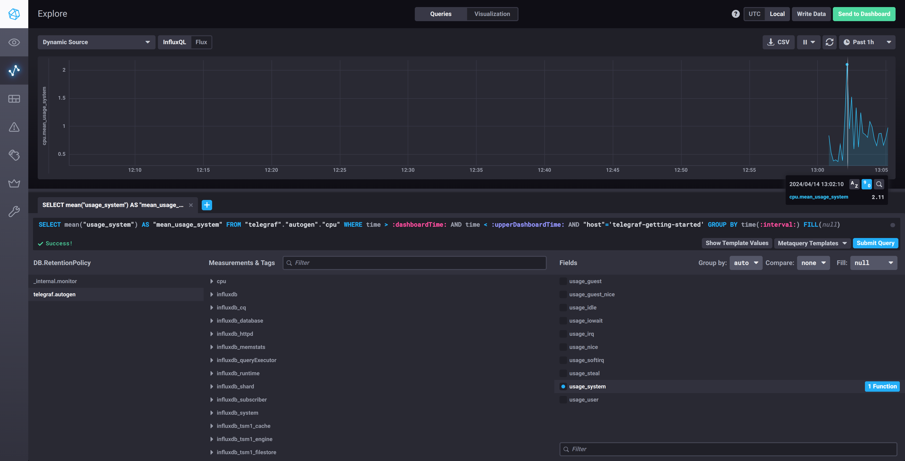
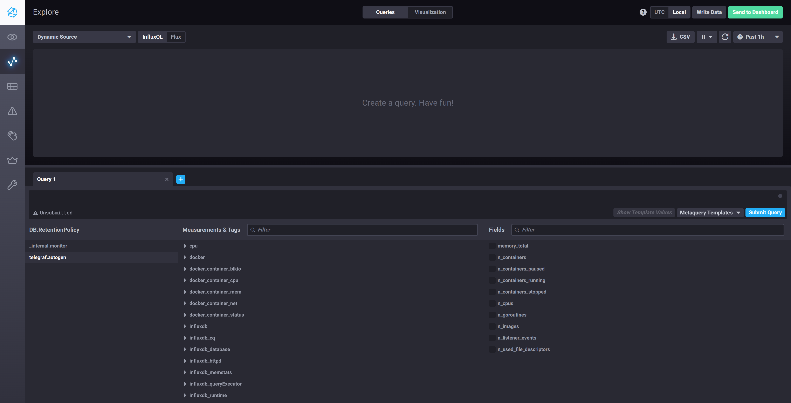

# Домашнее задание к занятию "Системы мониторинга"
---
## Основная часть
---
1. На проекте, где производятся вычисления с загрузкой ЦПУ и выдачей текстовых отчётов, которые сохраняются на диск, следует установить мониторинг следующих метрик:

    + **CPU Usage (Использование ЦПУ)**  
        Поскольку вычисления загружают процессор, мониторинг его загрузки поможет идентифицировать моменты максимальной нагрузки и потенциальные проблемы с производительностью.
    + **Memory Usage (Использование памяти RAM)**  
        Важно следить за использованием оперативной памяти, так как это может влиять на скорость и эффективность обработки данных.
    + **Disk Usage (Использование дискового пространства)**  
        Поскольку отчёты сохраняются на диск, необходимо мониторить доступное дисковое пространство, чтобы предотвратить его переполнение.
    + **HTTP Requests (HTTP запросы)**  
        Мониторинг количества и состояния HTTP запросов поможет оценить нагрузку на веб-сервер и оперативно выявить ошибки в работе веб-интерфейса.
    + **Error Rates (Частота ошибок)**  
        Отслеживание ошибок, возникающих в процессе работы приложения, позволит быстро реагировать на проблемы в системе.
---
2. Чтобы сделать мониторинг более понятным для менеджера продукта и помочь ему понимать качество обслуживания, можно ввести следующие метрики:

    + **SLA Performance (Выполнение SLA)**  
        Мониторинг процента успешно обработанных запросов (например, количество запросов с ответом 2xx делённое на общее количество запросов). Это даст представление о качестве сервиса.
    + **User Satisfaction Metrics (Метрики удовлетворенности пользователя)**  
        Включить опросы пользователей или анализ отзывов для оценки удовлетворенности.
    + **End-to-End Response Times (Время отклика от начала до конца)**  
        Измерение времени, необходимого для обработки запроса от момента его получения до момента выдачи ответа. Это поможет оценить производительность системы с точки зрения пользователя.  
---
3. В ситуации ограниченного финансирования на систему сбора логов можно использовать открытые и бесплатные инструменты:

    + **ELK Stack (Elasticsearch, Logstash, Kibana)**  
        Это комплексное решение для сбора, агрегации и визуализации логов. Можно использовать бесплатные версии данных инструментов.
    + **Prometheus и Grafana для сбора метрик и логов**  
        Эти инструменты также доступны бесплатно и могут быть настроены для сбора логов ошибок.
    + **Локальные скрипты или простые инструменты для сбора и отправки логов**  
        Например, использование скриптов на Python или Shell для периодической отправки логов на централизованный сервер или почту.
---
4. Если SLA по http-кодам ответов не поднимается выше 70%, но нет кодов 5xx и 4xx, проблема может быть в том, что в расчет не включены другие типы HTTP-ответов, такие как 3xx (редиректы) или другие успешные, но менее типичные ответы (например, 1xx, 2xx кроме 200). Необходимо перепроверить формулу расчета SLA:

    + Убедиться, что в расчет включены все успешные запросы (например, все 2xx ответы).  
    + Проверить, не происходит ли потеря данных при сборе метрик или ошибок в логике фильтрации запросов.
---

5. Основные плюсы и минусы pull и push систем мониторинга:

    **Pull системы:**  
    - 

Плюсы

     
      - *Управляемость*: Централизованный сервер управления запросами позволяет легче управлять конфигурациями и политиками безопасности.  

      - *Обнаружение ошибок*: При отсутствии данных от устройства, сервер может легко определить проблему, так как активно запрашивает данные.  
       
      - *Согласованность данных*: Данные собираются в определённые интервалы, что обеспечивает их согласованность.  
    

    - 

Минусы

     
      - *Неэффективность в высокодинамичных средах*: Постоянные запросы могут быть ресурсоёмкими и не всегда успевают за изменениями состояния системы.

      - *Проблемы с NAT и фаерволами*: Может быть сложно получить доступ к устройствам за NAT или фаерволами без дополнительной конфигурации.
    

    **Push системы:**  
    - 

Плюсы

     
      - *Мгновенная реакция на события*: Позволяет быстро реагировать на изменения в системе, отправляя данные при их возникновении. 

      - *Эффективность*: Устройства отправляют данные только при необходимости, что снижает нагрузку на сеть и сервер. 
       
      - *Легкость в конфигурации трансляции данных через NAT и фаерволы*: Устройства инициируют соединение, что упрощает их доступ из любой точки.  
    

    - 

Минусы

     
      - *Сложнее контролировать*: Труднее управлять безопасностью и конфигурациями, так как данные отправляются устройствами.

      - *Риск потери данных*: В случае сбоев или перегрузки сервера могут теряться важные данные.
    

---
6. Классификация систем мониторинга по модели (push или pull):

    + **Prometheus - Pull модель**  
        Преимущественно использует метод pull для сбора метрик с мониторимых устройств, но также поддерживает push для временных или динамических задач через Pushgateway.
    + **TICK (Telegraf, InfluxDB, Chronograf, Kapacitor) - Push модель**  
        Telegraf собирает данные и отправляет их в InfluxDB, что соответствует push модели.
    + **Zabbix - Гибридная модель** 
        Поддерживает как pull, так и push методы. Агенты Zabbix могут активно отправлять данные на сервер (push) или отвечать на запросы сервера (pull).
    + **VictoriaMetrics - Pull модель**  
        Преимущественно используется как долгосрочное хранилище для данных Prometheus и других систем, работающих по pull модели, но также поддерживает push для интеграции с различными агентами.
    + **Nagios - Pull модель** 
        Традиционно использует pull модель для проверки состояния сервисов и устройств, но также может конфигурироваться для приёма данных, отправленных активно от агентов.

7. Репозиторий склонирован, TICK-стэк запущен используя технологии docker и docker-compose.
---
8. Скриншот с отображением метрик утилизации cpu из веб-интерфейса

9. Метрики, связанные с docker в Chronograf

